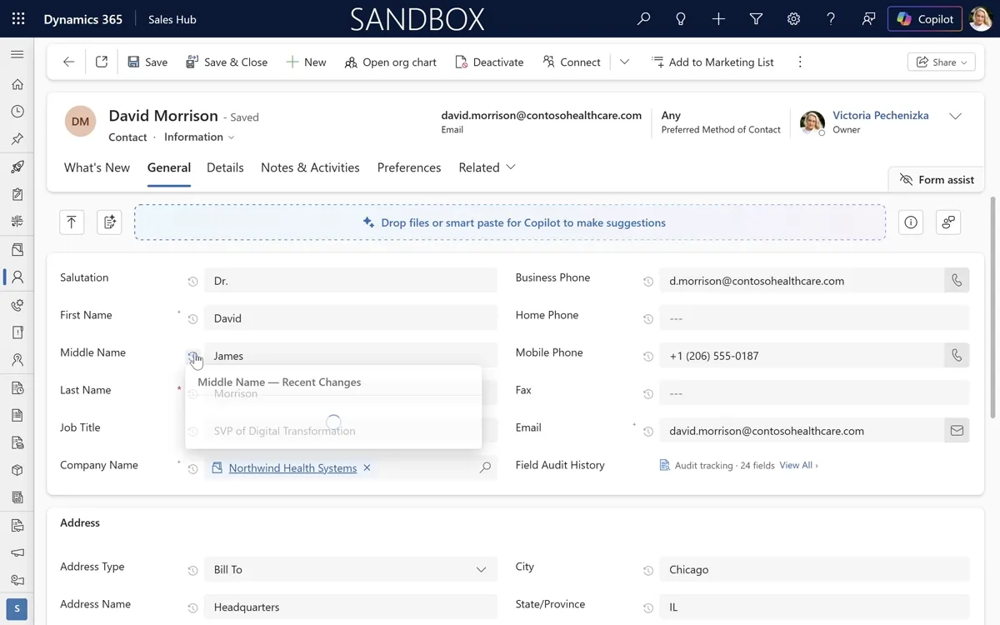
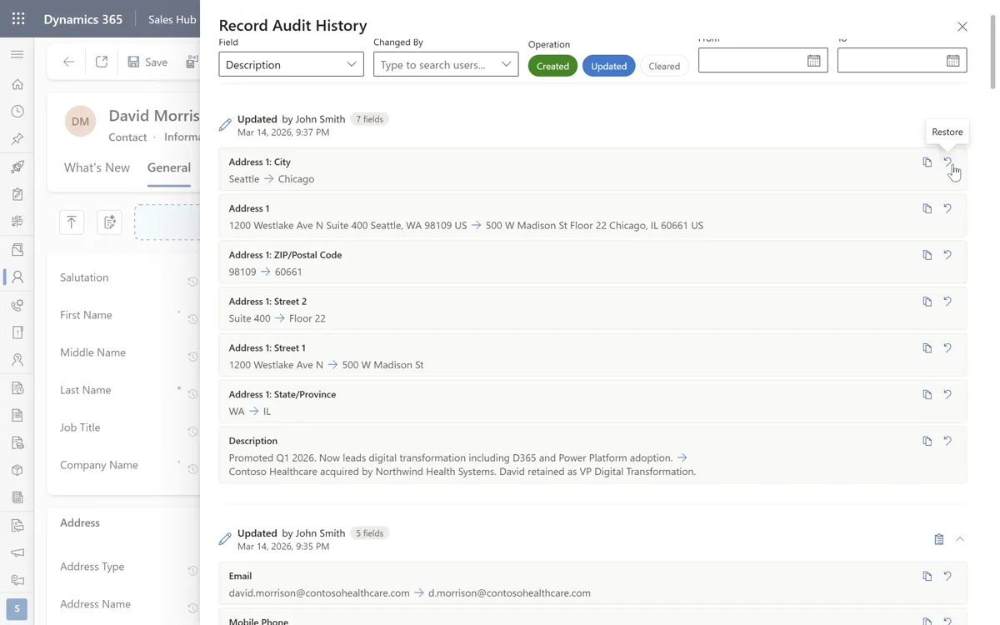
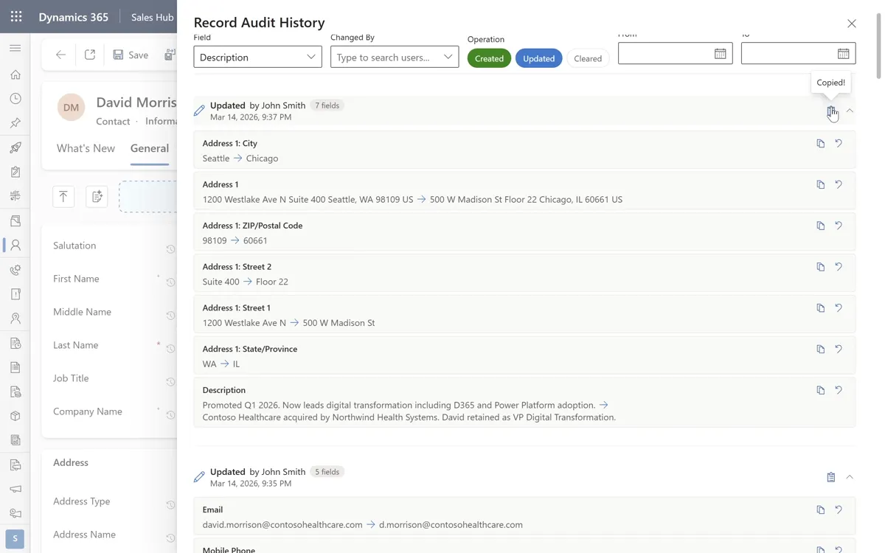

# Field Audit History

[](releases/)
[](LICENSE)
[](https://learn.microsoft.com/en-us/power-apps/developer/component-framework/overview)

**"Who changed this?" - answered in one click, not six.**

A free PCF control that puts Dataverse audit data right next to the field on Dynamics 365 forms. No more Related → Audit History → scroll → click → translate schema names.

https://github.com/user-attachments/assets/53679f92-df02-42b4-a080-47746540802f

---

## One Click. Real Answer.

Every audited field gets a clock icon. Click it - see who changed the value, when, and what it was before. Filter by user right inside the popup.



## Wrong Value? Fix It.

Every audit entry has **Copy** and **Restore**. Wrong value from a bad import? Restore it - one click, confirm, done. Need the old value for a ticket? Copy to clipboard. Need a compliance report? **Export CSV**.



## Full Audit Timeline

When one field isn't enough - open the full panel. Searchable filters, color-coded timeline, collapsible groups. All client-side, zero additional API calls.



---

## Features

The most comprehensive audit trail control for Dynamics 365 - built over 3 major versions, 90+ tests, and real production feedback.

- ✅ **One-click audit** on every audited field - no per-field setup
- ✅ **Quick Peek popup** with last 8 changes per field
- ✅ **Full sidecar panel** with complete record audit timeline
- ✅ **Value Restore** - revert any field to a previous value with confirmation
- ✅ **Copy to clipboard** - individual values or full entry summaries
- ✅ **CSV export** - filtered or full, ready for compliance reports
- ✅ **Searchable filters** - type to find fields and users, no scrolling
- ✅ **Filter by operation** - Created, Updated, Cleared
- ✅ **Date range filter** - calendar picker, narrow to any window
- ✅ **Collapsible entry groups** - chevron toggle with field count badges
- ✅ **Human-readable names** - "Email" not `emailaddress1`
- ✅ **Color-coded timeline** - green Created, blue Updated, orange Cleared
- ✅ **Auto-detection** - icons appear on all audited fields automatically
- ✅ **Configurable per table** - four modes: `audited`, `include`, `exclude`, `all`
- ✅ **JSON config via web resource** - no re-import, changes on next form load
- ✅ **Zero-impact form load** - audit data only fetches when a user clicks
- ✅ **Graceful degradation** - if anything fails, the form works normally
- ✅ **Clear error messages** - missing privileges? Tells you exactly which ones
- ✅ **No external calls** - no telemetry, no data leaves your environment
- ✅ **Works on any entity** - standard or custom, zero entity-specific setup

Missing a feature? [Open an issue](../../issues) - we build based on community feedback.

---

## Installation

1. **Download** the managed solution ZIP from [Releases](../../releases)
2. **Import** via Power Platform admin center → Solutions → Import
3. **Add a host field** - create a single-line text field on your entity (e.g., `vp365_audithost`)
4. **Bind the control** - form editor → select host field → add Field Audit History component
5. **Save and publish** - every audited field gets an icon automatically

No per-field setup. The control reads entity metadata and auto-detects audited fields.

## Configuration

Works out of the box. Customize via a JSON web resource (`vp365_AuditHistoryConfig`):

| Mode | Behavior | Best For |
|---|---|---|
| `audited` (default) | Icons on all audited fields | Most orgs |
| `include` | Only listed fields get icons | Show the 3-4 fields users care about |
| `exclude` | All audited fields except listed ones | Hide system noise like `modifiedon` |
| `all` | Icons on every visible field | Compliance reviews |

```javascript
var config = {
    tables: {
        "*": { mode: "audited", fields: [] },
        "contact": {
            mode: "include",
            fields: ["emailaddress1", "telephone1", "jobtitle"]
        },
        "account": {
            mode: "exclude",
            fields: ["modifiedon", "modifiedby"]
        }
    }
};
```

Config changes take effect on next form load - no re-import needed.

## Control Properties

| Property | Type | Required | Description |
|---|---|---|---|
| `boundField` | SingleLine.Text | Yes | Host field the control binds to. Not displayed - serves as anchor. |
| `configWebResourceName` | SingleLine.Text | No | Logical name of JSON config web resource. Defaults apply if omitted. |
| `pageSize` | Whole.None | No | Audit entries per API page (1–1000). Default: 25. |

## Compatibility

| | Supported |
|---|---|
| **Dynamics 365** | Online (2024 Wave 1+), model-driven apps only |
| **Browsers** | Edge, Chrome, Firefox (latest 2 versions) |
| **Mobile** | Desktop/tablet only |
| **Canvas apps** | Not supported |
| **Custom pages** | Not supported |
| **Power Pages** | Not supported |

## Troubleshooting

**No audit icons appear**
- Auditing must be enabled at three levels: org, entity, and field
- Host field must be on the form and bound to the control
- User needs `prvReadRecordAuditHistory` privilege

**"Unable to load audit history"**
- User needs `prvReadAuditSummary` privilege
- Check browser console for 403 errors

**Icons appear on unsaved records**
- Fixed in v3.3.0+. Update to latest version.

**Restore button missing on some entries**
- Entries from before v3.3.0 may lack raw values. Ensure `config.features.allowRestore` is `true`.

**CSV export is empty**
- Load audit entries in the panel before exporting.

## Solution Details

| | |
|---|---|
| **Solution** | `vp365_FieldAuditHistory` |
| **Version** | 3.4.2.0 |
| **Publisher** | vp365.ai |
| **React** | 16.14.0 (platform-provided) |
| **UI** | Fluent UI v8 |
| **Data access** | Read-only (except Restore on explicit user confirmation) |
| **External calls** | None |

## License

MIT - see [LICENSE](LICENSE)

## Author

**Victoria Pechenizka** - Power Platform & Dynamics 365 practitioner.

- Blog: [vp365.ai](https://vp365.ai)
- LinkedIn: [vp365ai](https://www.linkedin.com/in/vp365ai/)
- Read the full article: [Field Audit History - Free PCF Control for Dynamics 365](https://vp365.ai/blog/field-audit-history-inline-audit-trail-for-dynamics-365/)
